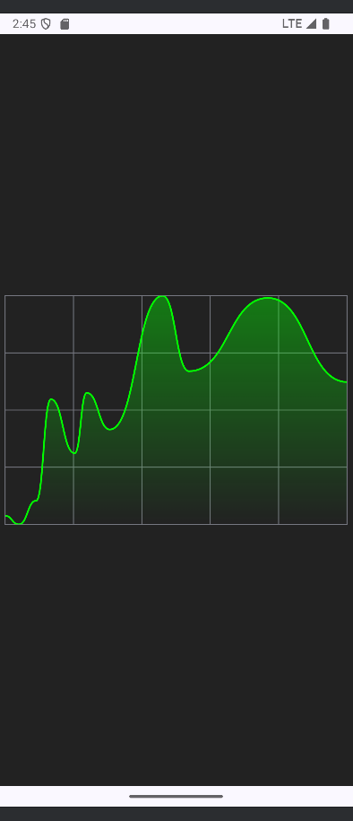

# Dibujando en Jetpack compose

Following the tutorial of "Basics of drawing", I like the exmaple of making a line chart using only drawing composables and animation. _All the code attributions corresponds to the video tutorial_.

## Screenshots

